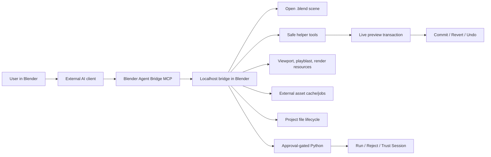

# Blender Agent Bridge

The safe, production-shaped bridge between Blender and external AI agents.

Blender Agent Bridge is a Blender extension plus a localhost MCP bridge. It lets tools such as Codex, Claude Desktop, Claude Code, Cursor, and other MCP-capable clients inspect the open Blender scene, gather visual evidence, call safe editing helpers, stage risky Python for approval, and leave every helper edit in a visible commit/revert preview.

<p align="center">
  
</p>

<p align="center">
  <a href="addon/claude_blender/blender_manifest.toml"></a>
  
  
  <a href="LICENSE"></a>
</p>

> The project was originally named Claude for Blender. The internal add-on id, Python package, zip name, local paths, and MCP environment variables still use `claude_blender` for compatibility.

## Quick Start

1. Install Blender `5.0.0` or newer.
2. In Blender, open `Edit > Preferences > Get Extensions`, add this remote repository, then sync and install `Blender Agent Bridge`:

   ```text
   https://callmejones.github.io/blender-agent-bridge/index.json
   ```

3. Enable the extension, open the 3D View sidebar, find `Agent Bridge`, and press `Start Bridge`.
4. Press `Copy MCP`, paste the generated config into Claude Desktop, Claude Code, Codex, Cursor, or another MCP client, then refresh or restart that client.
5. Ask the client:

   ```text
   List the objects in the current Blender scene and tell me which Blender Agent Bridge tools are available.
   ```

6. Try a reversible helper edit:

   ```text
   Move the selected cube up 1 Blender unit and make it red. Leave the change as a preview.
   ```

Live helper edits stay pending in Blender until you use `Commit`, `Revert`, or Blender undo. For Sketchfab downloads/imports, add `SKETCHFAB_API_TOKEN` to the copied MCP config `env` block before restarting the MCP client. For generated Python, use Blender's `Run`/`Reject` controls or grant temporary external script trust from the sidebar.

After connecting, MCP results may include `guardrail_warnings`. These are advisory client-routing hints, not failures: follow them toward async external asset jobs, queued imports, background render/MP4 polling, user-confirmed file paths, approval-gated scripts, and preview commit/revert controls.

## Why This Exists

AI agents are getting good at using tools, but Blender needs guardrails. This bridge gives agents real scene context and practical tools without turning Blender into a chat app or storing provider API keys.

- Blender stays the execution layer: scene state, viewport evidence, preview changes, approvals, checkpoints, and local resources.
- The external client stays the agent host: model connection, conversation memory, provider account, planning, and user chat.
- Generated Python is not the default path. Agents get structured helpers first, and arbitrary scripts stay approval-gated unless the user grants runtime session trust.
- The Blender sidebar includes a Bridge Control Center for source-hash freshness, stale MCP-client hints, active/last operation state, audit events, live-preview rollback manifests, and latest visual evidence resources.
- Advanced helper paths include bounded procedural object kits and directed animation shot templates before custom Python fallback.

## Showcase: Egypt Dogfight

These compressed images come from the `egypt.blend` project used while testing the bridge. The agent inspected a scene, used helper/workflow tools, captured playblast and render evidence, repaired issues, kicked off longer render jobs through bridge tooling, and validated the resulting output without relying on shell scripts or hidden in-Blender chat loops.

<p align="center">
  
</p>

<p align="center">
  
</p>

| Visual evidence | Diagnostic close-up | Render/playblast review |
| --- | --- | --- |
|  |  |  |

The source `.blend` file and full 1080p videos are not committed here; the repository only includes small showcase exports so the GitHub checkout stays light.

## What Agents Can Do

- Inspect scenes, selections, materials, animation data, rigs, cameras, render settings, compositor nodes, geometry nodes, collections, shape keys, particles, curves, text, and blend-file health.
- Read bounded viewport screenshots, sampled animation playblast frames, object inspection renders, render thumbnails, and long-render job resources through MCP.
- Check `.blend` diagnostics, save or autosave already-bound projects, and open or create project files only from user-confirmed paths.
- Search Poly Haven and Sketchfab catalogs, cache/import HDRIs, textures, and models, and report source, license, cache, and imported data-block diagnostics.
- Start external asset download/cache jobs for Poly Haven or Sketchfab, poll or cancel them, then import completed job results from cached manifests.
- Use animation workflow tools such as `run_animation_task`, `plan_animation_workflow`, `run_animation_workflow`, `review_playblast_against_brief`, and `run_animation_repair_loop`.
- Apply safe helper edits for transforms, materials, lights, cameras, primitives, keyframes, rigs, constraints, render settings, 2D storyboard/animatic panels, cutout animation layers, camera dolly shots, cloth setup, procedural array stacks, product stages, character/vehicle kits, geometry-node starters, and scene organization.
- Start long-running render jobs in a background Blender process, poll progress, assemble PNG sequences into MP4, and validate the output before reporting success.
- Search cached Blender Python API and Manual docs before using version-sensitive APIs, and use status/audit resources to spot stale client configs or timed-out work.
- Stage arbitrary Blender Python into the `Agent Bridge Pending Script` Text datablock when helpers cannot express the task.

## Safety Model

Connected agents do not get blanket access to Blender.

| Path | Behavior |
| --- | --- |
| Safe helper tools | Apply immediately as live preview transactions with `Commit`, `Revert`, and Blender undo support. |
| Visual capture tools | Store local project/session-scoped screenshots, playblast frames, inspection renders, thumbnails, and render outputs. |
| Project files | Save-as, save-copy, open, and new-project tools require a user-confirmed path. Autosave only saves an already-bound active `.blend` file in place. |
| External assets | Poly Haven uses public catalog/file APIs. Sketchfab downloads/imports require a per-call API token or a token inherited by the MCP server environment. Tokens are redacted and not written to job metadata. |
| Generated Python | Staged into a Text datablock and blocked until approved in Blender, unless runtime-only script trust is active. |
| External script trust | Optional sidebar preset for iterative sessions. Trust is runtime-only and can be revoked. Blocked scripts remain refused. |
| Audit and status | Local redacted JSONL audit events and bridge/MCP diagnostics are available through MCP resources and status calls. |
| MCP guardrail warnings | Advisory hints in catalog, schema, and tool results steer clients toward async jobs, queued imports, user-confirmed paths, approval gates, dry-run cleanup, preview commit/revert, and background-job polling. |
| Model provider keys | Not stored in Blender Agent Bridge. External clients bring their own model/provider connection. |

See [SECURITY.md](SECURITY.md), [PRIVACY.md](PRIVACY.md), and [docs/SAFETY_MODEL.md](docs/SAFETY_MODEL.md) for the detailed model.

## Install From GitHub

Best update-friendly path: add the GitHub Pages extension repository in Blender.

1. In Blender, open `Edit > Preferences > Get Extensions`.
2. Open the repositories menu, choose `Add Remote Repository`, and enter:

   ```text
   https://callmejones.github.io/blender-agent-bridge/index.json
   ```

3. Sync/update the repository, search for `Blender Agent Bridge`, and install it.
4. Enable `Blender Agent Bridge`.
5. Open the 3D View sidebar, find `Agent Bridge`, then use `Start Bridge` and `Copy MCP`.

Manual fallback: download the packaged ZIP from the latest GitHub Release.

1. Open the [latest GitHub release](https://github.com/CallMeJones/blender-agent-bridge/releases/latest).
2. Download `claude_blender-<version>.zip` from the release assets.
3. In Blender, open `Edit > Preferences > Get Extensions`, use `Install from Disk`, and choose the downloaded ZIP.
4. Enable `Blender Agent Bridge`, then use `Start Bridge` and `Copy MCP`.

Do not install GitHub's generated "Source code" ZIP as the Blender extension. Use the release asset or the remote extension repository.

See [docs/INSTALL_FROM_GITHUB.md](docs/INSTALL_FROM_GITHUB.md) for checksum verification, update steps, troubleshooting, and the maintainer release flow.

## Optional Sketchfab Auth

Poly Haven discovery and imports do not need a token. Sketchfab public search is tokenless, but Sketchfab model download/import tools need an API token.

Add the token to the MCP server config `env` block that your client actually launches, then refresh or restart that MCP client:

```json
"env": {
  "SKETCHFAB_API_TOKEN": "your-sketchfab-api-token"
}
```

`BLENDER_AGENT_BRIDGE_SKETCHFAB_API_TOKEN` is also accepted. For Claude Desktop, Claude Code, Codex, Cursor, and similar MCP clients, the token must be visible to the MCP server process, not just Blender. The MCP server forwards it to Blender as a redacted per-call argument because Blender often does not inherit the client environment.

Use `blender_bridge_status` and check `mcp_external_asset_auth.sketchfab` when debugging a stale config. Use `get_external_asset_cache_diagnostics` to inspect the Blender-side cache and auth view. OAuth is intentionally deferred for now; the supported public path is API-token auth.

## How It Works



The MCP surface is compact by default, so clients do not need to load the whole helper catalog into prompt context. They get a small direct surface for status, scene listing, `.blend` diagnostics, external asset discovery/jobs, animation workflows, and async render jobs, plus `blender_tool_catalog` / `search_blender_tools` to search compact summaries. Fetch one schema only when needed with `get_blender_tool_schema`, then call it through `invoke_blender_tool`. When a result includes `guardrail_warnings`, treat them as routing and recovery hints before retrying direct fallback tools.

Some MCP clients cache tool lists and server configs. After installing a new ZIP, reloading the add-on, or pressing `Copy MCP`, replace the old client config and refresh or restart that MCP client.

See [docs/EXTERNAL_BRIDGE_MCP.md](docs/EXTERNAL_BRIDGE_MCP.md) for setup and troubleshooting.

## Try These Prompts

With an object selected:

```text
Move the selected cube up 1 Blender unit and make it red.
```

```text
Make the selected cube bounce twice over 72 frames, getting smaller each bounce. Check it against the brief and leave it as a preview.
```

```text
Block a jump with anticipation, contact, apex, and settle. Review spacing and contact before you report back.
```

```text
Capture close-up inspection renders of the selected vehicle underside, review them against the brief, and suggest repair operations.
```

```text
Render a 1080p playblast as a background job, poll it, assemble the MP4, and validate the output.
```

```text
Search Poly Haven for a sunset HDRI, cache it as an external asset job, poll until it is ready, then queue the import into the world as a preview.
```

```text
Check whether Sketchfab auth is available in this MCP config, then search for a downloadable Falcon 9 model, start an external asset download job if the token is present, poll it, queue the import job, and poll until the import completes.
```

```text
Check the current blend-file diagnostics and autosave only if the scene is already saved to a real .blend path.
```

Live helper changes, including external asset imports, remain pending until you use `Commit`, `Revert`, or Blender undo. Generated Python remains pending until you use `Run`, `Approve External`, `Reject`, or an active trusted session allows it.

## Install From Source

Build and validate the extension ZIP from the repository root:

```powershell
$Version = python -c "import tomllib; print(tomllib.load(open('addon/claude_blender/blender_manifest.toml','rb'))['version'])"
blender --command extension validate addon\claude_blender
python scripts\build_extension_zip.py --blender blender
blender --command extension validate "dist\claude_blender-$Version.zip"
```

The build writes:

```text
dist/claude_blender-<version>.zip
dist/claude_blender-<version>.zip.sha256
```

For day-to-day development on Windows, link the checkout into Blender's user extension repository:

```powershell
.\scripts\link_blender_dev_extension.ps1
```

See [docs/DEVELOPMENT.md](docs/DEVELOPMENT.md) for alternate Blender versions and custom extension repositories.

## Development Checks

Run pure-Python checks:

```powershell
python -m compileall addon\claude_blender tests
python tests\smoke_helper_routing.py
python tests\smoke_release_consistency.py
python tests\smoke_bridge_protocol_validation.py
python tests\smoke_mcp_server.py
python tests\smoke_build_extension_zip.py
python tests\smoke_audit_log.py
python tests\smoke_external_assets.py
```

Set `BLENDER_AGENT_BRIDGE_LIVE_PAGES_SMOKE=1` before `smoke_release_consistency.py` to also verify the deployed GitHub Pages extension index advertises the current manifest version and that its hosted ZIP matches the advertised SHA-256 hash.

Optional live-network external asset smoke is skipped by default:

```powershell
$env:BLENDER_AGENT_BRIDGE_LIVE_EXTERNAL_ASSET_SMOKE='1'
python tests\smoke_external_assets_live.py
```

Set `BLENDER_AGENT_BRIDGE_LIVE_EXTERNAL_ASSET_DOWNLOAD=1` to also download small assets. Sketchfab download smoke additionally requires `SKETCHFAB_API_TOKEN` or `BLENDER_AGENT_BRIDGE_SKETCHFAB_API_TOKEN` plus `BLENDER_AGENT_BRIDGE_LIVE_SKETCHFAB_UID`.

Run Blender-background smoke tests when Blender is available:

```powershell
& 'C:\Program Files\Blender Foundation\Blender 5.1\blender.exe' --background --factory-startup --python tests\smoke_context_docs.py
& 'C:\Program Files\Blender Foundation\Blender 5.1\blender.exe' --background --factory-startup --python tests\smoke_bridge_server.py
& 'C:\Program Files\Blender Foundation\Blender 5.1\blender.exe' --background --factory-startup --python tests\smoke_animation_helpers.py
& 'C:\Program Files\Blender Foundation\Blender 5.1\blender.exe' --background --factory-startup --python tests\smoke_tool_selection.py
& 'C:\Program Files\Blender Foundation\Blender 5.1\blender.exe' --background --factory-startup --python tests\smoke_project_files.py
& 'C:\Program Files\Blender Foundation\Blender 5.1\blender.exe' --background --factory-startup --python tests\smoke_render_jobs.py
& 'C:\Program Files\Blender Foundation\Blender 5.1\blender.exe' --background --factory-startup --python tests\smoke_external_asset_imports.py
```

## Documentation

- [docs/ARCHITECTURE.md](docs/ARCHITECTURE.md) - architecture and subsystem overview.
- [docs/INSTALL_FROM_GITHUB.md](docs/INSTALL_FROM_GITHUB.md) - GitHub install, update, and release flow.
- [docs/CONTEXT_AND_DOCS_ENGINE.md](docs/CONTEXT_AND_DOCS_ENGINE.md) - context planning, docs cache, visual evidence, and prompt budgeting.
- [docs/LIVE_PREVIEW_LOOP.md](docs/LIVE_PREVIEW_LOOP.md) - reversible live helper transactions.
- [docs/SAFETY_MODEL.md](docs/SAFETY_MODEL.md) - approval, preview, script, and bridge safety rules.
- [docs/EXTERNAL_BRIDGE_MCP.md](docs/EXTERNAL_BRIDGE_MCP.md) - localhost bridge and MCP server.
- [docs/TESTING_GUIDE.md](docs/TESTING_GUIDE.md) - comprehensive automated testing runbook for all feature and tool surfaces.
- [docs/RELEASE.md](docs/RELEASE.md) - release build and verification checklist.

## Repository Layout

```text
addon/claude_blender/          Blender extension source
docs/                          Project, architecture, safety, and release notes
docs/assets/                   Lightweight README showcase images
scripts/                       Build and development helper scripts
tests/                         Pure-Python and Blender smoke tests
CHANGELOG.md                   Release notes
SECURITY.md                    Security policy and hardening checklist
PRIVACY.md                     Local data and provider-data notes
LICENSE                        GPL-3.0-or-later license text
```

## License

Blender Agent Bridge is licensed under the GNU General Public License, version 3 or any later version. The Blender extension manifest declares this as `SPDX:GPL-3.0-or-later`; see [LICENSE](LICENSE) for the full license text. Release ZIPs include the license file at the package root.
