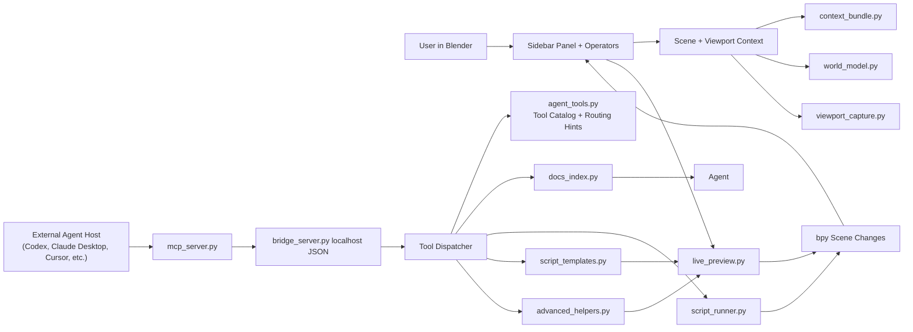

# Architecture

## System Shape

## Architecture Decision

Use a Blender extension as the source of truth for scene access, plus a local companion bridge surface. The extension can read and write `bpy` state directly, while a stdio MCP server can let external clients such as Codex, Claude Desktop, Claude Code, or other agents discover Blender resources and call Blender tools.

The add-on does not host an LLM provider. External clients own model/provider connections; Blender owns scene access, safety checks, preview rollback, script approval, local resources, and diagnostics.

## External Bridge Strategy

`bridge_server.py` runs inside Blender and exposes a localhost-only JSON bridge on `127.0.0.1`. It queues operations onto Blender's main thread before touching `bpy`, then returns JSON results. `mcp_server.py` is a dependency-free stdio MCP server that external AI clients launch. It implements MCP lifecycle/tools/resources requests and forwards tool/resource calls to the running Blender bridge.

This keeps the important boundary clean: MCP clients never import Blender Python and never touch `bpy` directly. Blender remains the authority for scene state, preview rollback, script approval, and UI status.

## Blender Extension Layer

The add-on should be packaged as a Blender extension:

- `blender_manifest.toml` at the extension root.
- `type = "add-on"`.
- `blender_version_min = "4.2.0"` unless testing shows a newer minimum is needed.
- `[permissions] network = "..."`
- `[permissions] files = "..."` if docs caches, viewport captures, checkpoints, transcripts, audit logs, or exports are written.

The UI should use normal Blender classes:

- `bpy.types.Panel` for the 3D View sidebar.
- `bpy.types.Operator` for capture, approve, run, cancel, undo, bridge control, and checkpoint actions.
- `bpy.types.AddonPreferences` for local paths, bridge settings, privacy, execution mode, and docs settings.
- `bpy.props` for persistent settings and operator inputs.

## External Agent Loop

External clients should receive or request a context bundle for the current user request:

- A stable system prompt describing Blender tool boundaries.
- The user's request.
- Blender version, active mode, workspace, and relevant limitations.
- A scene digest and focused selected-object details.
- Animation, material, camera, light, render, and unit summaries when relevant.
- Optional image content for viewport screenshots.
- Tool definitions for safe, narrow operations.

External clients may respond directly or request a tool. For tool calls, the add-on executes the tool locally and returns the result through MCP/bridge. Generated Python should be stored as a proposal first. Running a proposal is a separate user-approved or trust-window action.

Before generating non-trivial code, external agents should either already have enough scene/docs context or explicitly call tools to get it. The bridge should steer clients toward this sequence: inspect, retrieve docs if needed, plan, draft, review, run.

Tool schemas are selected dynamically per request. The full local tool catalog remains available inside Blender, while compact MCP mode exposes the bridge/control/animation/render tools that should be easy for clients to find. Provider-neutral routing hints in `agent_tools.py` keep the request closer to Codex-style local tool use: Blender owns the toolbox, and external clients decide what to show their models.

## Scene Context Strategy

Use layered structured summaries before screenshots and full data dumps:

- Environment layer: Blender version, Python version, platform, render engine, active mode, active workspace, scene unit system, frame range, current frame.
- Scene layer: collections, object counts by type, cameras, lights, world settings, render settings.
- Selection layer: active object, selected objects, transforms, dimensions, bounds, modifiers, constraints, material slots.
- Object-detail layer: requested object data including mesh counts, shape keys, drivers, custom properties, linked data, library status.
- Animation layer: actions, f-curves, keyframes, constraints, drivers, markers, camera paths.
- Material layer: material settings, shader node summaries, texture/image references, color management.
- Deep world-model layer: read-only summaries for geometry nodes, shader nodes, armatures, constraints/drivers, shape keys, curves/text, simulations, collection/view-layer organization, render/camera settings, and compositor nodes.
- Visual layer: viewport screenshot or preview render, with camera/view metadata.
- Capability layer: available safe tools and helper APIs.

This keeps tokens and privacy under control while still giving external agents useful grounding.

## Visual Context Strategy

Support two visual modes:

- Viewport screenshot: fast, reflects what the user sees.
- Preview render: slower, better for lighting/material critique.

Current implementation captures a bounded PNG screenshot from Blender's UI when the user enables the `Viewport` toggle. The image is prepared as external-client visual evidence and stripped from transcript-visible context. If the PNG is too large, Blender's image API downscales and re-saves a smaller copy before exposure. Saved `.blend` projects store captures in a project-local `.claude_blender/captures/<session_id>` folder by default, with a global user-cache fallback for unsaved or unwritable projects. The MCP bridge also exposes the latest capture and exact capture ids as image resources for external clients. If Blender is headless or the operator fails, the bundle records that visual context was requested but unavailable.

Animation playblast capture uses the same storage boundary and writes sampled viewport PNG frame sequences under the active capture session. MCP clients can read playblast metadata and exact frame resources, which gives agents visible poses for reviewing timing, spacing, staging, arcs, contact, and prompt intent before later repair loops.

For repeated images or larger workflows, the Files API may help later, but it should remain optional because it is beta and has different retention behavior.

## Docs Strategy

Recommended path:

1. Detect the running Blender version with `bpy.app.version`.
2. Search the curated local JSON docs cache for that version.
3. Search the full local Python API docs index when the user has built it.
4. Search the full local Blender Manual index for workflow/UI concepts when the user has built it.
5. Return concise snippets with API symbol names, Manual sections, examples, URLs, and citation refs.
6. Return official Blender docs index/search URLs when no local snippet matches.

The docs tool should return concise snippets plus URLs, not whole pages. The agent should cite doc URLs in the transcript when docs influenced code and use the search report/source breakdown to explain whether results came from local indexes or official fallback URLs.

For scripting tasks, client guidance should tell external agents to look up docs before using APIs they are uncertain about, especially animation data, drivers, geometry nodes, operators with context requirements, and extension-specific behavior.

## Safe Helper Strategy

Common changes should use typed helper tools before arbitrary code:

- `create_primitive`
- `set_selected_location_delta`
- `set_selected_transform`
- `assign_material_to_selected`
- `add_light`
- `add_camera`
- `set_scene_frame_range`
- `animate_selected_transform`
- `create_camera_orbit`
- `add_modifier`
- `set_render_settings`
- `create_shader_material`
- `add_geometry_nodes_modifier`
- `create_shape_key`
- `animate_shape_key`
- `create_text_object`
- `create_curve_path`
- `add_particle_system_to_selected`
- `create_basic_armature`
- `add_copy_transform_constraint`
- `set_camera_settings`
- `set_world_background`
- `shade_smooth_selected`
- `add_bevel_and_subsurf`
- `create_wheel_assembly`
- `add_panel_seams`
- `add_window_materials`
- `apply_vehicle_refinement_template`
- `apply_product_refinement_template`
- `apply_character_refinement_template`
- `create_studio_product_stage`
- `add_dimension_callouts`
- `apply_lighting_preset`
- `create_material_palette`
- `create_product_turntable_setup`
- `organize_scene_for_production`

Helpers can validate object names, expected types, frame ranges, and value ranges before applying changes. When a helper is too limited, an external agent can fall back to a proposed Python script.

Advanced helpers live in `advanced_helpers.py` and still write through the live-preview transaction layer. They should cover bounded starter actions for deep systems, while arbitrary custom node graphs, rigs, simulations, and destructive edits stay in the approval-gated script path.
Refinement helpers also live in `advanced_helpers.py` for now. If product/character/vehicle kits grow further, split them into a dedicated template module with shared bounds/material/primitive utilities.

## Live Preview Strategy

The add-on should support immediate visual feedback through a reversible preview transaction:

1. User enables live preview or approves a low-risk action class.
2. The external agent calls a typed helper such as `set_selected_transform`, `assign_material_to_selected`, `add_light`, or `animate_selected_transform`.
3. The helper validates inputs and records the previous state needed for rollback.
4. The change is applied to the actual Blender scene on the main thread.
5. The add-on updates dependency state and requests viewport/timeline redraw.
6. The sidebar shows the preview as pending with `Commit` and `Revert` controls.

Live preview should be helper-first. Arbitrary generated Python should not run automatically in live preview mode unless the user explicitly elevates that action.

For animation edits, the preview layer should insert/update keyframes immediately, then either keep the current frame or jump to a relevant changed frame depending on the user's setting.

## Script Execution Strategy

Execution should go through one controlled Blender operator:

1. Generate code proposal.
2. Parse and compile the proposal.
3. Display code, target objects, expected changes, and risk labels.
4. Run static checks for blocked modules, dangerous calls, file/network/process access, and broad destructive edits.
5. Save undo point/checkpoint.
6. Execute inside Blender's main thread with controlled globals and captured stdout/stderr/reports.
7. Return the result to the external client and show it to the user.

Default mode should be approval-required. Later, an autonomous mode can allow only prebuilt safe tools without arbitrary code execution.

## Dependency Strategy

Options:

- Provider adapters should live in external clients, companion examples, or demo packages, not in the production add-on.

## User Decisions

- First supported Blender target: 5.1.
- LLM/provider transport lives outside Blender.
- Docs lookup: local cache first, official web docs second.
- Screenshot context: controlled by a toggle.
- UI: support sidebar first, design for optional floating surface.
- Live safe helper changes: apply immediately and show logs/status rather than pre-change plans.
- Arbitrary generated Python: approval required.
- Import/export: approval required.
